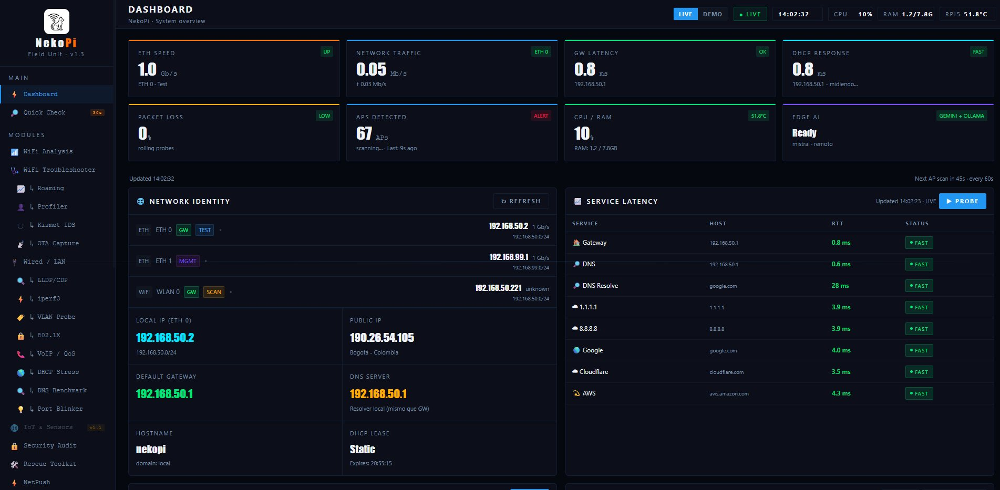
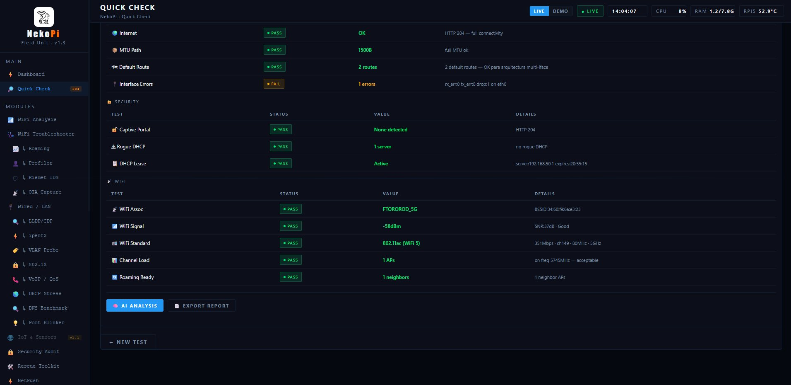
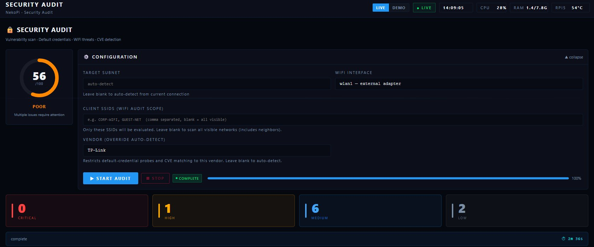
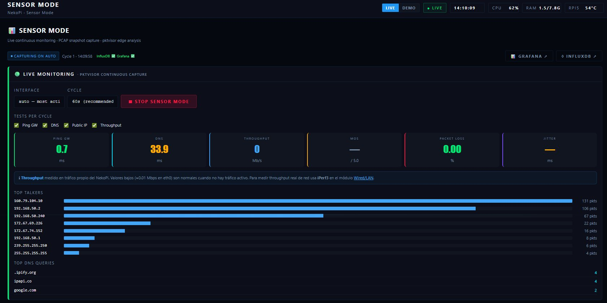

<div align="center">
  

# NekoPi Field Unit

**v1.3.0 — Codename: ToManchas 🐱🐱**

[](LICENSE)
[](https://www.raspberrypi.com)
[](https://python.org)
[](https://fastapi.tiangolo.com)

A **vendor-agnostic, open-source** network diagnostic toolkit built on Raspberry Pi 5.  
Designed for field engineers who need a powerful, portable, and affordable alternative to expensive commercial tools.

[Installation](#installation) · [Modules](#modules) · [Hardware](#hardware) · [Screenshots](#screenshots)

</div>

<div align="center">

> 🚧 **This project is in active development and beta testing.**
> Hardware compatibility and feature stability are not guaranteed.
> **Do not purchase hardware based solely on this project** until a stable v1.0 release is announced.
> Some modules may be incomplete, unstable, or change without notice.

</div>

## 🌐 Live Demo

Try the interactive demo at **[nekopi.net](https://nekopi.net)** — no hardware required. Simulated data, all modules visible.

---

## What is NekoPi?

NekoPi is a field network diagnostic platform that runs on a Raspberry Pi 5. It provides a web-based interface accessible from any browser on the same network, featuring 25+ diagnostic modules covering WiFi analysis, wired LAN testing, security auditing, AI-powered analysis, and more.

Inspired by the [WLANPi Project](https://www.wlanpi.com).  
Built in Bogotá, Colombia 🇨🇴

---

## Installation

```bash
# Clone the repository
git clone https://github.com/Ftororod/nekopi.git /opt/nekopi

# Run the automated installer (23 steps, ~15-20 min)
cd /opt/nekopi && sudo ./install_nekopi.sh

# Access NekoPi from your browser
https://[RPi5-IP]:8080
```

> **Note:** The management interface (eth1) provides DHCP on `192.168.99.x`.  
> Connect your laptop directly to eth1 and access NekoPi at `https://192.168.99.1:8080`

---

## Modules

### 📶 WiFi (6 modules)
| Module | Description |
|--------|-------------|
| **Quick Check** | Instant WiFi + LAN + Gateway diagnostics — RSSI, SNR, TX rate, DNS, ping in one shot |
| **WiFi Analysis** | Full environment scan with co-channel interference detection and AI analysis |
| **WiFi Troubleshooter** | Guided diagnostic flow — PHY mode, beacon interval, retry rate, band width |
| **Roaming Analyzer** | Passive 802.11r/k/v capture — FT timing, deauth detection, roaming events |
| **OTA Capture** | Passive WiFi frame capture to PCAP — channel hopping or fixed channel |
| **Client Profiler** | Virtual AP to capture Association Requests — profiles client capabilities for RRM |

### 🔌 Wired (6 modules)
| Module | Description |
|--------|-------------|
| **Wired / LAN** | LLDP/CDP discovery, iPerf3 throughput, VLAN probe, 802.1x, VoIP/QoS, DNS benchmark |
| **NetPush** | SSH config push to multiple Cisco IOS/IOS-XE devices simultaneously |
| **Console Pusher** | Serial console via FTDI — line-by-line config push with configurable delay |
| **Path Analyzer** | Visual traceroute with RTT per hop, packet loss, AI-powered path analysis |
| **Rescue Toolkit** | TFTP server for IOS images (up to 1.5GB+) with progress bar and MD5 verification |
| **DHCP Options Manager** | Custom DHCP option injection — Cisco CW917X presets (Meraki→Catalyst Option 43 f3 format) |

### 🔒 Security + AI (5 modules)
| Module | Description |
|--------|-------------|
| **Security Audit** | 4-phase scan — open ports, default credentials, CVE lookup, circular score gauge |
| **Kismet IDS** | Wireless IDS — rogue APs, deauth attacks, evil twin detection |
| **Network Scan** | Host discovery, OS fingerprinting, Nmap-based with AI threat analysis |
| **Edge AI / Deep Analysis** | Local AI via Ollama (Mistral) or Gemini API — PCAP, logs, config analysis |
| **Sensor Mode** | Continuous monitoring with pktvisor + InfluxDB + Grafana (on-demand, saves ~550MB RAM) |

### ⚙️ System
Terminal · Console (Cockpit) · Reports · Tools · Connection · About · Settings

---

## Hardware

### Tested Configuration
| Component | Spec |
|-----------|------|
| Platform | Raspberry Pi 5 (8GB) |
| OS | Ubuntu 24.04 LTS |
| Ethernet HAT | RTL8125B 2.5GbE (eth0 — TEST) |
| Native ETH | RPi5 built-in GbE (eth1 — MGMT, 192.168.99.1) |
| WiFi Monitor | CF-953AX MT7921AU (wlan1 — monitor mode) |
| Serial | FTDI USB adapter |

### Minimum Requirements
- Raspberry Pi 4/5 (4GB+)
- Ubuntu 22.04+ or Raspberry Pi OS
- 2× Ethernet interfaces
- WiFi adapter with monitor mode
- 32GB+ microSD or SSD

---

## Software Stack

The installer automatically sets up:

| Component | Purpose | Mode |
|-----------|---------|------|
| FastAPI + Uvicorn | Backend API (HTTPS) | Always on |
| Ollama + Mistral | Local AI inference | Always on |
| dnsmasq | DHCP on mgmt interface | Always on |
| Cockpit | Web system console | Always on |
| InfluxDB | Time-series metrics | On-demand |
| Grafana | Metrics dashboard | On-demand |
| Kismet | Wireless IDS | On-demand |
| pktvisor | Network traffic analysis | On-demand |
| ttyd | Web terminal (SSL) | On-demand |

> InfluxDB and Grafana are **disabled at boot** and only start when Sensor Mode is activated — saving ~550MB RAM.

---

## Screenshots

<div align="center">

### Dashboard


### Quick Check — 15/16 PASS


### Security Audit


### Sensor Mode


</div>

---

## Interface Layout

```
eth0  → TEST (2.5GbE HAT)     — connect to network under test
eth1  → MGMT (native GbE)     — connect laptop here (192.168.99.1)
wlan0 → SCAN (built-in WiFi)  — connected to network under test  
wlan1 → MONITOR (USB WiFi)    — passive capture / monitor mode
```

---

## License

NekoPi Field Unit is licensed under the **GNU General Public License v3.0**.

This means you are free to use, modify, and distribute NekoPi, but any
derivative work must also be open source under GPL v3. You cannot take
this code, close it, and sell it as a proprietary product without
contributing your changes back to the community.

See [LICENSE](LICENSE) for the full license text.

---

## Contributing

NekoPi is open source under the GPL v3 License. Contributions, bug reports and feature requests are welcome.

1. Fork the repository
2. Create your feature branch (`git checkout -b feature/amazing-feature`)
3. Commit your changes (`git commit -m 'feat: add amazing feature'`)
4. Push to the branch (`git push origin feature/amazing-feature`)
5. Open a Pull Request

---

## Author

**Fabián Toro Rodríguez**  
Network & Infrastructure Specialist · Bogotá, Colombia 🇨🇴

Certifications: CCNP Enterprise · CCNA · CCS-EWD · CCS-EWI · CCS-EAI · CCS-ECore · Ekahau ECSE Design · Cisco CMNA (Meraki)  
In progress: CCNP Wireless (350-101 WLCOR)

[](https://github.com/Ftororod/nekopi)
[](https://co.linkedin.com/in/fabian-toro-rodriguez-200a43185)

---

<div align="center">
  <sub>NekoPi Field Unit · v1.3.0 · Codename: ToManchas · GPL v3 License</sub>
</div>
